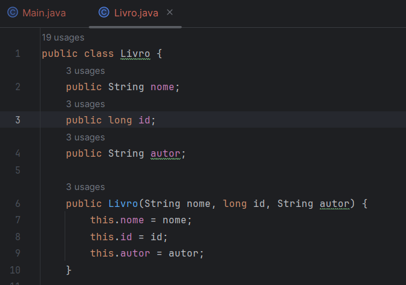
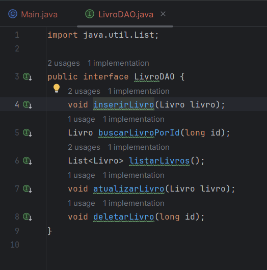
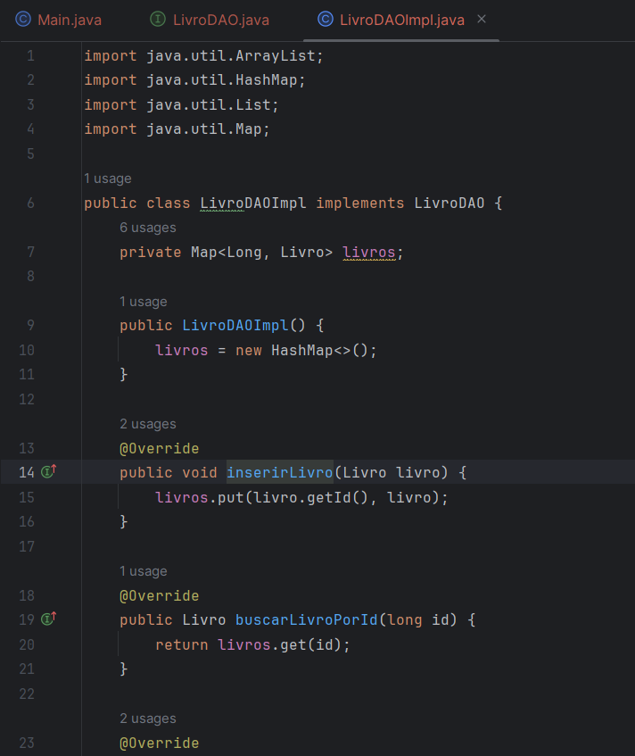
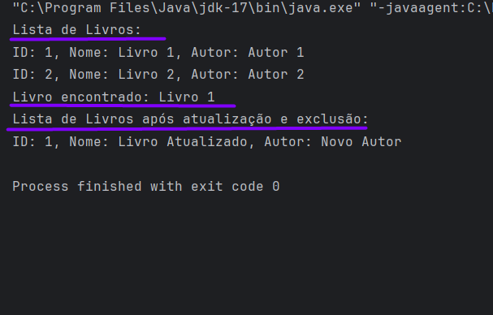

# DAO_Express 🚀
## Uma rápida descrição do padrão DAO.

### Avisos ⚠️
* Não está no padrão MVC, como fiz rápido está tudo na mesma pasta, bagunça.
* Fonte : Slide de Tosta e CHATGPT
* Qualquer dúvida ou qualquer delírio de minha parte pelo conteúdo, por favor me avise.

### Padrão DAO 🤖

O padrão DAO é como um uma camada entre sua aplicação e um lugar onde você armazena informações, como um banco de dados. Em vez de mexer diretamente com o banco de dados em todos os lugares do seu código, você cria um "guardião" que cuida disso para você. Isso torna seu código mais organizado, fácil de entender e como está no splide do professor Tosta facilita a manutenção, caso você queira mudar onde armazena seus dados no futuro.

Então, como o contexto do PBL se trata disso, criei para esse exemplo um objeto Livro com atributos, construtor e getters e setters, poderia ser qualquer outro, aqui pouco importa é só a base do que está em nosso contexto. 

Após isso eu criei a interface, que é um contrato pra implementar essas coisas nela aí. É uma formalização do que deve ser feito. Aqui são métodos bem genéricos vistos em qualquer CRUD por ai, inserir, buscar ... .

Aqui a classe que implementa o DAO, já usando uma pá de coisa que o Java já dá de recurso.

Na proxima imagem tem um print da main rodando alguns desses métodos que eu criei. 

O que eu faço nó códiga da main é : leiam o código.

Não sei qual será a solução de vocês no PBL em termos de persistência, mas isso é uma base bem curtinha usando HashMap lá no lado da DAO.
